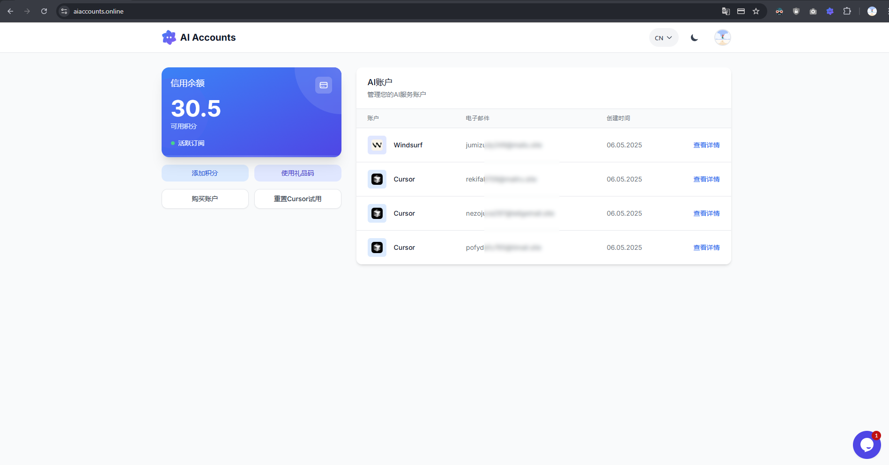
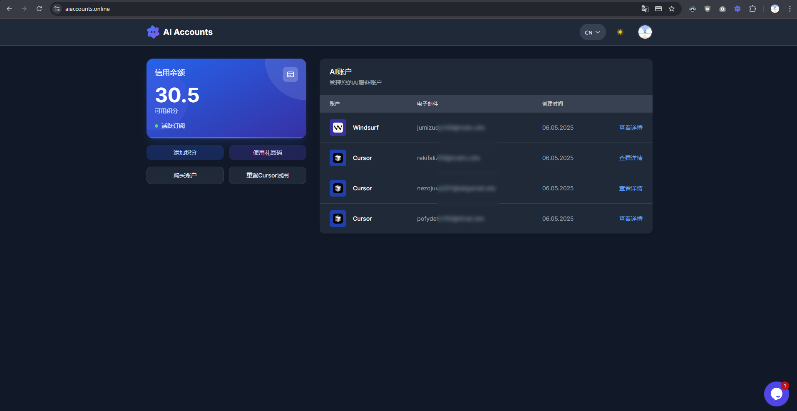

# AI Auto Free (  )

> **重要提示：** 此服务不再活跃或维护。

<div align="center">
  <a href="README.md">English</a> |
  <a href="README.tr.md">Türkçe</a> |
  <a href="README.cn.md">中文</a>
</div>

<br>

AI Auto Free是一个综合性自动化工具，可以无限制地使用如Cursor和Windsurf等人工智能驱动的IDE。

该工具允许您以经济实惠的方式直接拥有创建的账户。

## 重要警告
该工具仅为研究和教育目的而开发。请负责任地使用。开发者不对使用该工具可能产生的任何问题承担责任。

## 支持的语言

| 语言        |            |            |
|-------------|------------|------------|
| English     | Türkçe     | Deutsch    |
| العربية     | Français   | Português  |
| Русский     | 中文       |            |

## 截图




### Common Issues

- #### Too many free trial accounts
错误：Too many free trial accounts used on this machine.
解决方法：由于您在同一设备上使用了多个Cursor试用账户，因此被检测到。为快速解决此问题，请在终端中运行以下命令：

**Windows 用户：**
```
irm https://raw.githubusercontent.com/yuaotian/go-cursor-help/refs/heads/master/scripts/run/cursor_win_id_modifier.ps1 | iex
```

**Mac 用户：**
```
curl -fsSL https://aizaozao.com/accelerate.php/https://raw.githubusercontent.com/yuaotian/go-cursor-help/refs/heads/master/scripts/run/cursor_mac_id_modifier.sh -o ./cursor_mac_id_modifier.sh && sudo bash ./cursor_mac_id_modifier.sh && rm ./cursor_mac_id_modifier.sh
```

**Linux 用户：**
```
curl -fsSL https://raw.githubusercontent.com/yuaotian/go-cursor-help/refs/heads/master/scripts/run/cursor_linux_id_modifier.sh | sudo bash
```

- #### Our servers are currently overloaded
错误：Our servers are currently overloaded for non-pro users, and you've used your free quota.
解决方法：当您的账户额度用完时会出现此错误。如果还有额度但仍然收到此错误，可能Cursor服务器对试用账户进行了临时限制。请稍等片刻或尝试退出重新登录。

- #### Unauthorized Request
错误：User is unauthorized.
解决方法：您使用的账户未授权，已被Cursor封禁。

- #### High Load
错误：We're experiencing high demand for Claude 3.7 Sonnet right now.
解决方法：由于使用量大，Cursor暂时对试用账户限制了Claude相关模型。请稍后再试。

- #### Trial Request Limit
错误：You've reached your trial request limit.
解决方法：您的试用账户额度已用完。可通过获取新账户继续使用。

- #### Your request has been blocked as our system
错误：Your request has been blocked as our system has detected suspicious activity from your account/ip address.
解决方法：如果您的账户曾被Cursor封禁，您的IP可能已被列入黑名单。请更换网络IP或使用"Warp"工具：https://one.one.one.one/

- #### Connection Failed
错误：If the problem persists, please check your internet connection or VPN, or email us at hi@cursor.sh.

### 常见问题解答

- #### 这个工具做什么？
像Cursor和Windsurf这样帮助我们编码的人工智能驱动的IDE在免费计划中有限制使用。您可以使用此工具来克服这一限制。

获得账户后，您可以通过点击您收到的账户来切换到该账户。这样，您可以使用多个账户。

- #### 如何使用这个工具？
您可以通过向账户添加信用点数来开始获取账户。您获取的账户信息将显示在您的主页上。您可以通过这些账户的详细选项卡访问根据账户类型的其他功能，例如检查限制或自动打开账户。但是，某些功能可能需要浏览器扩展。

获取账户后，您可以立即使用它们。

随着账户限额耗尽，您可以通过获取新账户继续使用。但是，对于Cursor账户，为了避免使用前出现任何警告，最好使用主页上的Cursor试用重置按钮。最好按需获取账户，而不是一次性获取所有账户，因为有时账户可能会被提供商封禁。

- #### 如果我创建一个新账户，我的代码或与AI的对话（上下文）会被删除吗？
不会，它们不会被删除。

# Cursor Patch

适用于MacOS、Linux和Windows的Cursor应用程序的简单补丁工具。

## 使用方法

### Windows

在PowerShell中运行：

```powershell
irm https://raw.githubusercontent.com/ruwiss/ai-auto-free/refs/heads/master/utils/patch_cursor.ps1 | iex
```

如果有执行策略限制，您可以运行：

```powershell
Set-ExecutionPolicy -ExecutionPolicy Bypass -Scope Process -Force; irm https://raw.githubusercontent.com/ruwiss/ai-auto-free/refs/heads/master/utils/patch_cursor.ps1 | iex
```

### MacOS和Linux

在终端中运行：

```bash
chmod +x ./utils/patch_cursor.sh
./utils/patch_cursor.sh
```

或直接使用curl：

```bash
curl -fsSL https://raw.githubusercontent.com/ruwiss/ai-auto-free/refs/heads/master/utils/patch_cursor.sh | bash
```

## 功能

此补丁通过以下方式修改Cursor的设备识别机制：

1. 为机器ID生成随机UUID
2. 设置随机MAC地址
3. 绕过Windows注册表检查
4. 创建随机设备ID

在进行任何修改之前，所有原始文件都会备份并带有`.bak`扩展名。

## 注意事项

- 在运行补丁之前，请确保Cursor已关闭
- 您可能需要使用提升的权限运行这些脚本
- 如果需要恢复，将保留原始备份文件

## 许可证

MIT
