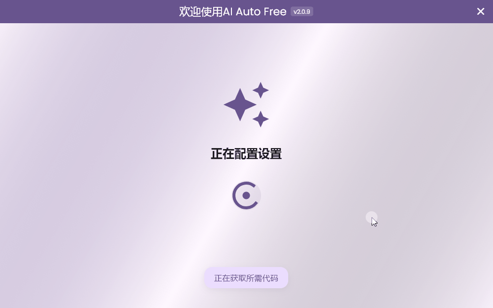

# AI Auto Free

<div align="center">
  <a href="README.md">English</a> |
  <a href="README.tr.md">Türkçe</a> |
  <a href="README.cn.md">中文</a>
</div>

<br>

> **注意：** 该程序目前仅支持Windows操作系统。

# [下载最新的](https://github.com/kodu67/ai-auto-free/releases/latest)

AI Auto Free是一个综合性自动化工具，可以无限制地使用如Cursor和Windsurf等人工智能驱动的IDE。

该工具允许您以经济实惠的方式直接拥有创建的账户。

## 重要警告
该工具仅为研究和教育目的而开发。请负责任地使用。开发者不对使用该工具可能产生的任何问题承担责任。

## 支持的语言

| 语言 |  |  |
|----------|----------|----------|
| English  | Türkçe  | 中文 |

## 截图

### Windows

___
### 账户创建器
完全自动化。您无需做任何事情。它通过池（服务器）为您检索先前创建的账户。
___

### 要求
- Python 10及以上版本（推荐最新版本）
- Google Chrome

### 常见问题

- #### 试用版限制超出
```text
Too many free trial accounts used on this machine.
Please upgrade to pro. We have this limit in place
to prevent abuse. Please let us know if you believe
this is a mistake.
```

```text
You've reached your trial request limit.
```
您可能会收到Cursor的这些错误。您只需点击应用程序中的按钮即可移除Cursor试用版警告。

- #### 未授权请求
这是Cursor端出现的错误。表示您使用的电子邮件/电子邮件域名已被Cursor服务阻止。

___
### 常见问题解答
- #### 这个工具做什么？
像Cursor和Windsurf这样帮助我们编码的人工智能驱动的IDE在免费计划中有限制使用。您可以使用此工具来克服这一限制。

获得账户后，您可以通过点击您收到的账户来切换到该账户。这样，您可以使用多个账户。

- #### 如果我创建一个新账户，我的代码或与AI的对话（上下文）会被删除吗？
不会，它们不会被删除。
___
