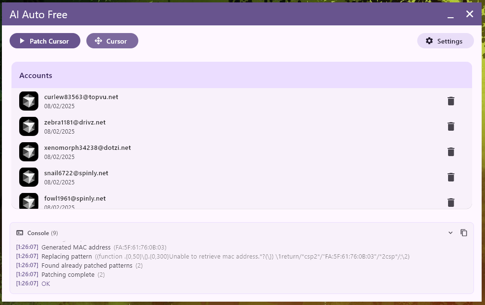

# AI Auto Free

<div align="center">
  <a href="README.md">English</a> |
  <a href="README.tr.md">Türkçe</a> |
  <a href="README.md.cn">中文</a>
</div>

<br>

> **NOTE:** This program currently only supports Windows operating system.

# [CLICK HERE TO DOWNLOAD THE TOOL](https://github.com/kodu67/ai-auto-free/releases/latest)

AI Auto Free is a comprehensive automation tool that enables unlimited use of AI-powered IDEs such as Cursor and Windsurf.

This tool allows you to directly own the created accounts in a cost-effective way.

## Important Warning
This tool has been developed for research and educational purposes only. Please use it responsibly. The developer does not accept any responsibility for any issues that may arise from the use of this tool.

## Supported Languages

| Language |  |  |
|----------|----------|----------|
| English  | Türkçe  | 中文 |

## Screenshots

### Windows

___
### Account Creator
It is completely automatic. You don't need to do anything. It retrieves previously created accounts for you through the pool (server).
___

### Requirements
- Python version 10 and above (Latest version recommended)
- Google Chrome

### Common Issues

- #### Trial Version Limit Exceeded
```text
Too many free trial accounts used on this machine.
Please upgrade to pro. We have this limit in place
to prevent abuse. Please let us know if you believe
this is a mistake.
```

```text
You've reached your trial request limit.
```
You may receive these errors for Cursor. All you need to do is click the button in the application to remove the Cursor trial version warning.

- #### Unauthorized Request
This is an error seen on the Cursor side. It indicates that the email/email domain you are using has been blocked by Cursor services.

___
### Frequently Asked Questions
- #### What does this tool do?
AI-powered IDEs like Cursor and Windsurf that help us code have limited use in the free plan. You can use this tool to overcome this limitation.

After getting an account, you can switch to the account by clicking on the account you received. This way, you can use multiple accounts.

- #### If I create a new account, will my code or conversations with AI (context) be deleted?
No, they won't be deleted.
___
