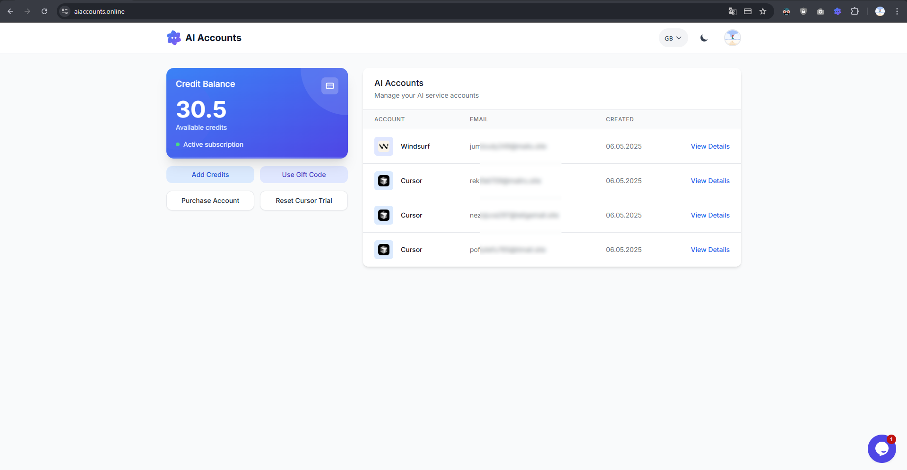

# AI Auto Free (  )

> **IMPORTANT:** This service is no longer active or maintained.

<div align="center">
  <a href="README.md">English</a> |
  <a href="README.tr.md">Türkçe</a> |
  <a href="README.cn.md">中文</a>
</div>

<br>

AI Auto Free is a comprehensive automation tool that enables unlimited use of AI-powered IDEs such as Cursor and Windsurf.

This tool allows you to directly own the created accounts in a cost-effective way.

## Important Warning
This tool has been developed for research and educational purposes only. Please use it responsibly. The developer does not accept any responsibility for any issues that may arise from the use of this tool.

## Supported Languages

| Language    |            |            |
|-------------|------------|------------|
| English     | Türkçe     | Deutsch    |
| العربية     | Français   | Português  |
| Русский     | 中文       |            |

## Screenshots




### Common Issues

- #### Too many free trial accounts
Error: Too many free trial accounts used on this machine.
Solution: You have been detected for using multiple Cursor trial accounts on the same device. To solve this, you need to use an additional tool. For a quick solution, run the following command in your terminal:

**For Windows Users:**
```
irm https://raw.githubusercontent.com/yuaotian/go-cursor-help/refs/heads/master/scripts/run/cursor_win_id_modifier.ps1 | iex
```

**For Mac Users:**
```
curl -fsSL https://aizaozao.com/accelerate.php/https://raw.githubusercontent.com/yuaotian/go-cursor-help/refs/heads/master/scripts/run/cursor_mac_id_modifier.sh -o ./cursor_mac_id_modifier.sh && sudo bash ./cursor_mac_id_modifier.sh && rm ./cursor_mac_id_modifier.sh
```

**For Linux Users:**
```
curl -fsSL https://raw.githubusercontent.com/yuaotian/go-cursor-help/refs/heads/master/scripts/run/cursor_linux_id_modifier.sh | sudo bash
```

- #### Our servers are currently overloaded
Error: Our servers are currently overloaded for non-pro users, and you've used your free quota.
Solution: This error may appear when your account limit is reached. If you still have quota but see this, Cursor servers may be temporarily restricted for trial accounts. Wait a while or try logging out and back in.

- #### Unauthorized Request
Error: User is unauthorized.
Solution: The account you are using is unauthorized or blocked by Cursor.

- #### High Load
Error: We're experiencing high demand for Claude 3.7 Sonnet right now.
Solution: Cursor has temporarily restricted Claude models for trial accounts due to high demand. Please wait and try again.

- #### Trial Request Limit
Error: You've reached your trial request limit.
Solution: Your trial account limit is reached. You can continue by obtaining a new account.

- #### Your request has been blocked as our system
Error: Your request has been blocked as our system has detected suspicious activity from your account/ip address.
Solution: If your account has been previously banned by Cursor, your IP address may be blacklisted. Change your internet IP or use the "Warp" tool: https://one.one.one.one/

- #### Connection Failed
Error: If the problem persists, please check your internet connection or VPN, or email us at hi@cursor.sh.

### Frequently Asked Questions

- #### What does this tool do?
AI-powered IDEs like Cursor and Windsurf that help us code have limited use in the free plan. You can use this tool to overcome this limitation.

After getting an account, you can switch to the account by clicking on the account you received. This way, you can use multiple accounts.

- #### How to use this tool?
You can start acquiring accounts by adding credits to your account. The information of the accounts you have acquired will be displayed on your home page. You can access other features according to the account type from the detail tab of these accounts, such as checking limits or automatically opening the account. However, some features may require a browser extension.

You can use the accounts immediately after acquiring them.

As your account limit is exhausted, you can continue using by acquiring new accounts. However, for Cursor accounts specifically, to avoid any warnings before using, it would be good to use the Cursor Trial Reset button on the home page. It would be better for you to get accounts as needed rather than acquiring them all at once, as sometimes accounts can be banned by providers.

- #### If I create a new account, will my code or conversations with AI (context) be deleted?
No, they won't be deleted.

# Cursor Patch

A simple utility to patch Cursor application for MacOS, Linux, and Windows.

## Usage

### Windows

Run in PowerShell:

```powershell
irm https://raw.githubusercontent.com/ruwiss/ai-auto-free/refs/heads/master/utils/patch_cursor.ps1 | iex
```

If you have execution policy restrictions, you can run:

```powershell
Set-ExecutionPolicy -ExecutionPolicy Bypass -Scope Process -Force; irm https://raw.githubusercontent.com/ruwiss/ai-auto-free/refs/heads/master/utils/patch_cursor.ps1 | iex
```

### MacOS and Linux

Run in Terminal:

```bash
chmod +x ./utils/patch_cursor.sh
./utils/patch_cursor.sh
```

Or directly with curl:

```bash
curl -fsSL https://raw.githubusercontent.com/ruwiss/ai-auto-free/refs/heads/master/utils/patch_cursor.sh | bash
```

## What it does

This patch modifies Cursor's device identification mechanism by:

1. Generating a random UUID for the machine ID
2. Setting a random MAC address
3. Bypassing the Windows registry checks
4. Creating a random device ID

All original files are backed up with a `.bak` extension before any modifications.

## Notes

- Make sure Cursor is closed before running the patch
- You might need to run these scripts with elevated privileges
- Original backup files are preserved in case you need to restore

## License

MIT
