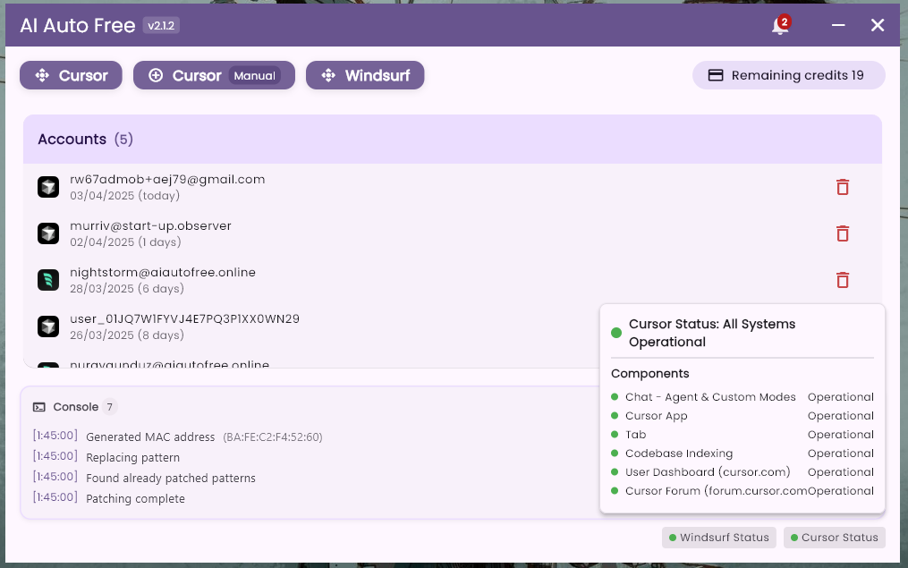

# AI Auto Free

> **NOTE:** This program currently only supports Windows operating system.

# [CLICK HERE TO DOWNLOAD THE TOOL](https://github.com/kodu67/ai-auto-free/releases/latest)

AI Auto Free is a comprehensive automation tool that enables unlimited usage of AI-powered IDEs like Cursor and Windsurf.

This tool allows you to directly own created accounts in a cost-effective way.

## Important Notice
This tool is developed for research and educational purposes only. Please use responsibly. The developer assumes no liability for any issues that may arise from using this tool.

## Supported Languages

| Language |  |  |
|----------|----------|----------|
| English  | Türkçe  | 中文 |

## Screenshots

### Windows



___
### Cursor Account Creator
It's fully automatic. You don't need to do anything.

___
### Settings
Browser Visibility: By default, the browser is hidden while operations are being performed. If you want to see how automatic account creation processes are done, enable this option.

Email Verifier: By default, the "Temporary" option is selected. If this option is selected, it will perform email verification using temp mail services. However, since the services we create accounts for block temp mail services, there is a chance of encountering problems. In this case, you can select the "IMAP" option.

If the IMAP option is selected, it will perform email verification using IMAP services.
___
### Common Issues
- #### Trial Limit Exceeded
```text
Too many free trial accounts used on this machine.
Please upgrade to pro. We have this limit in place
to prevent abuse. Please let us know if you believe
this is a mistake.
```

```text
You've reached your trial request limit.
```
Solution: You need to enable proxy mode.

- #### Unauthorized Request
This is an error seen on the Cursor side. It indicates that the email/email domain you are using has been blocked by Cursor services.

- #### Windsurf Registration Server is Unavailable
The Windsurf registration server may sometimes become unavailable. In this case, we have no choice but to wait for the Windsurf servers. You can try again later.

- #### Windsurf Token Not Accepted
The account creation process might not have been completed successfully. This is related to the above issue.
___
### Frequently Asked Questions
- #### What does this tool do?
IDEs like Cursor and Windsurf that help us code with artificial intelligence have limited usage in the free plan. You can use this tool to overcome this limit.

- #### If I create a new account, will my codes or conversations with AI (context) be deleted?
No, they won't be deleted.
___
