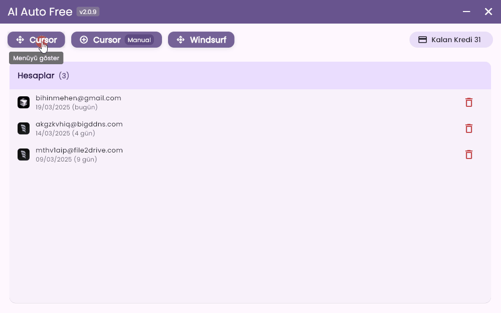

# AI Auto Free

<div align="center">
  <a href="README.md">English</a> |
  <a href="README.tr.md">Türkçe</a> |
  <a href="README.cn.md">中文</a>
</div>

<br>

> **NOT:** Bu program şu anda sadece Windows işletim sistemini desteklemektedir.

# [Son sürümü indir](https://github.com/kodu67/ai-auto-free/releases/latest)

AI Auto Free, Cursor ve Windsurf gibi yapay zeka destekli IDE'lerin sınırsız kullanımını sağlayan kapsamlı bir otomasyon aracıdır.

Bu araç, oluşturulan hesapları uygun maliyetli bir şekilde doğrudan sahiplenmenizi sağlar.

## Önemli Uyarı
Bu araç yalnızca araştırma ve eğitim amaçlı geliştirilmiştir. Lütfen sorumlu bir şekilde kullanın. Geliştirici, bu aracın kullanımından kaynaklanabilecek herhangi bir sorun için sorumluluk kabul etmez.

## Desteklenen Diller

| Dil |  |  |
|----------|----------|----------|
| English  | Türkçe  | 中文 |

## Ekran Görüntüleri

### Windows

___
### Hesap Oluşturucu
Tamamen otomatiktir. Hiçbir şey yapmanıza gerek yok. Daha önceden oluşturulmuş hesapları havuz (sunucu) üzerinden sizin için getirir.
___

### Gereksinimler
- Python versiyon 10 ve üzeri (Son sürüm tavsiye edilir)
- Google Chrome

### Sık Karşılaşılan Sorunlar

- #### Deneme Sürümü Limiti Aşıldı
```text
Too many free trial accounts used on this machine.
Please upgrade to pro. We have this limit in place
to prevent abuse. Please let us know if you believe
this is a mistake.
```

```text
You've reached your trial request limit.
```
Cursor için bu hataları alabilirsiniz. Tek yapmanız gereken uygulama üzerindeki Cursor deneme sürümü uyarısı kaldırma butonuna tıklamanız.

- #### Unauthorized Request
Bu, Cursor tarafında görülen bir hatadır. Kullandığınız e-posta/e-posta alan adının Cursor hizmetleri tarafından engellendiğini gösterir.

___
### Sıkça Sorulan Sorular
- #### Bu araç ne yapar?
Cursor ve Windsurf gibi yapay zeka ile kod yazmamıza yardımcı olan IDE'ler ücretsiz planda sınırlı kullanıma sahiptir. Bu sınırı aşmak için bu aracı kullanabilirsiniz.

Hesap aldıktan sonra, aldığınız hesabın üzerine tıklayarak hesaba geçiş yapabilirsiniz. Böylece birden fazla hesap kullanımı sağlayabilirsiniz.

- #### Yeni bir hesap oluşturursam, kodlarım veya yapay zeka ile yaptığım konuşmalar (bağlam) silinir mi?
Hayır, silinmezler.
___
