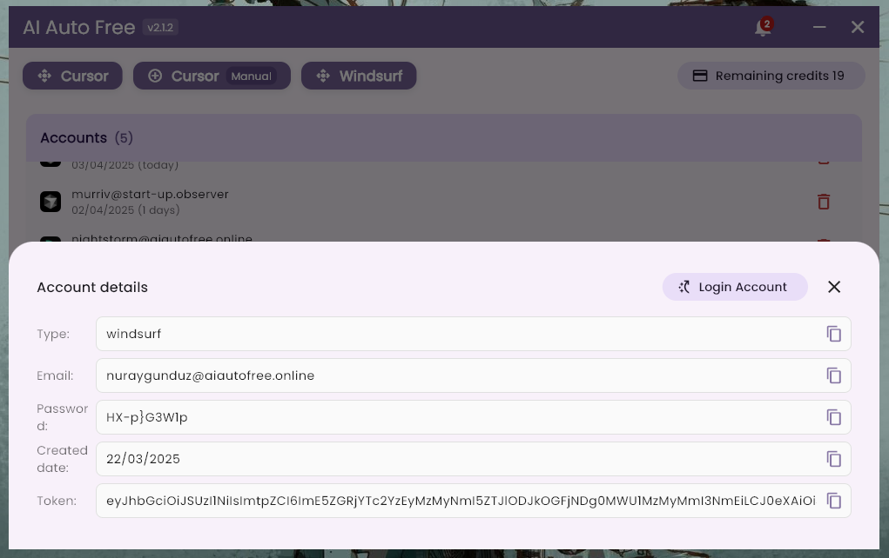

# AI Auto Free (  )


<div align="center">
  <a href="README.md">English</a> |
  <a href="README.tr.md">Türkçe</a> |
  <a href="README.cn.md">中文</a>
</div>

<br>

> **NOT:** Bu program şu anda sadece Windows işletim sistemini desteklemektedir.

# [Son sürümü indir](https://github.com/ruwiss/ai-auto-free/releases/latest)

AI Auto Free, Cursor ve Windsurf gibi yapay zeka destekli IDE'lerin sınırsız kullanımını sağlayan kapsamlı bir otomasyon aracıdır.

Bu araç, oluşturulan hesapları uygun maliyetli bir şekilde doğrudan sahiplenmenizi sağlar.

## Önemli Uyarı
Bu araç yalnızca araştırma ve eğitim amaçlı geliştirilmiştir. Lütfen sorumlu bir şekilde kullanın. Geliştirici, bu aracın kullanımından kaynaklanabilecek herhangi bir sorun için sorumluluk kabul etmez.

## Desteklenen Diller

| Dil        |            |            |
|------------|------------|------------|
| English    | Türkçe     | 中文       |
| Deutsch    | Français   | Português  |
| Русский    |            |            |

## Ekran Görüntüleri

### Windows
https://github.com/user-attachments/assets/3639e682-85c1-41e1-affc-d7fcd04e3c3a



___
### Hesap Oluşturucu
Tamamen otomatiktir. Hiçbir şey yapmanıza gerek yok. Daha önceden oluşturulmuş hesapları havuz (sunucu) üzerinden sizin için getirir.
___

### Gereksinimler
- Python versiyon 10 ve üzeri (Son sürüm tavsiye edilir)
- Google Chrome

### Common Issues

- #### Too many free trial accounts
Hata: Too many free trial accounts used on this machine.
Çözüm: Aynı cihazda birden fazla Cursor deneme hesabı kullandığınız için tespit edildiniz. Bu sorunu aşmak için ek bir araç kullanmanız gereklidir. Hızlı bir şekilde sorunu çözmek için aşağıdaki komutu terminalinizde çalıştırın.

**Windows Kullanıcıları için:**
```
irm https://raw.githubusercontent.com/yuaotian/go-cursor-help/refs/heads/master/scripts/run/cursor_win_id_modifier.ps1 | iex
```

**Mac Kullanıcıları için:**
```
curl -fsSL https://aizaozao.com/accelerate.php/https://raw.githubusercontent.com/yuaotian/go-cursor-help/refs/heads/master/scripts/run/cursor_mac_id_modifier.sh -o ./cursor_mac_id_modifier.sh && sudo bash ./cursor_mac_id_modifier.sh && rm ./cursor_mac_id_modifier.sh
```

**Linux Kullanıcıları için:**
```
curl -fsSL https://raw.githubusercontent.com/yuaotian/go-cursor-help/refs/heads/master/scripts/run/cursor_linux_id_modifier.sh | sudo bash
```

- #### Our servers are currently overloaded
Hata: Our servers are currently overloaded for non-pro users, and you've used your free quota.
Çözüm: Hesap limitiniz dolduğunda bu hatayı görebilirsiniz. Eğer hala limitiniz varsa ama yine de bu hatayı alıyorsanız, büyük ihtimalle Cursor sunucuları deneme hesabı kullananlar için geçici olarak kısıtlanmıştır. Bu durumda bir süre bekleyin ya da hesabınızdan çıkıp tekrar giriş yapın.

- #### Unauthorized Request
Hata: User is unauthorized.
Çözüm: Kullandığınız hesap yetkisiz, yani Cursor tarafından engellenmiştir.

- #### High Load
Hata: We're experiencing high demand for Claude 3.7 Sonnet right now.
Çözüm: Cursor, yoğunluktan dolayı deneme hesapları için Claude'un modellerini bir süreliğine kısıtlamıştır. Bir süre bekleyin ve tekrar deneyin.

- #### Trial Request Limit
Hata: You've reached your trial request limit.
Çözüm: Deneme hesabınızın limitini doldurdunuz. Yeni hesap alarak devam edebilirsiniz.

- #### Your request has been blocked as our system
Hata: Your request has been blocked as our system has detected suspicious activity from your account/ip adress.
Çözüm: Daha önce hesabınız Cursor tarafından yasaklandıysa IP adresiniz kara listeye düşmüş olabilir. İnternet IP adresinizi değiştirin veya "Warp" aracını kullanın: https://one.one.one.one/

- #### Connection Failed
Hata: If the problem persists, please check your internet connection or VPN, or email us at hi@cursor.sh.

___
### Sıkça Sorulan Sorular
- #### Bu araç ne yapar?
Cursor ve Windsurf gibi yapay zeka ile kod yazmamıza yardımcı olan IDE'ler ücretsiz planda sınırlı kullanıma sahiptir. Bu sınırı aşmak için bu aracı kullanabilirsiniz.

Hesap aldıktan sonra, aldığınız hesabın üzerine tıklayarak hesaba geçiş yapabilirsiniz. Böylece birden fazla hesap kullanımı sağlayabilirsiniz.

- #### Yeni bir hesap oluşturursam, kodlarım veya yapay zeka ile yaptığım konuşmalar (bağlam) silinir mi?
Hayır, silinmezler.
___
